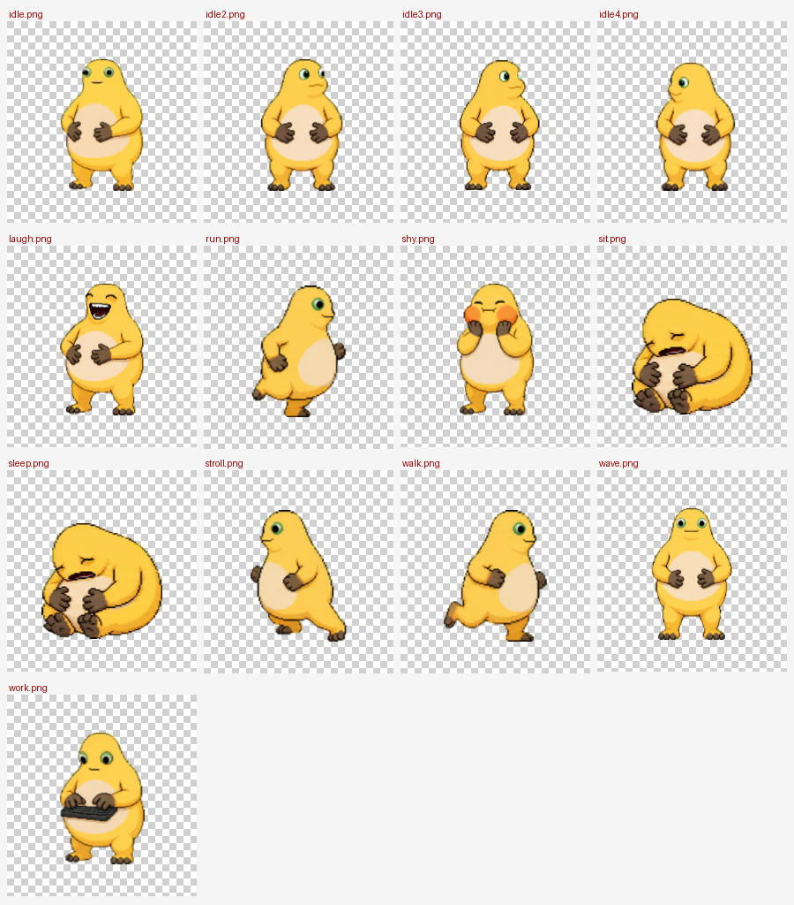
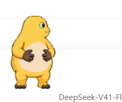

# 奶龙桌宠 · Nailong Desktop Pet

一只住在 Windows 桌面上的小奶龙。
素材取自你给的那张精灵图集（1536×2288，8 列 × 11 行，74 帧，自带真透明通道），
**全部动作都是图集里真实存在的，没有一帧是凭空造的、也没有一帧被重绘过**。



<p align="center">
  
  &nbsp;&nbsp;
  
</p>

---

## 安装

三种装法，挑一种就行。装完**重启 DeepSeek Harness**，奶龙会跟着一起起来。

### 方式一：下载安装包，双击就装（推荐）

去 [Releases](https://github.com/zhangkk833-byte/dsh-nailong-pet/releases) 下载
`nailong-pet-installer-v0.1.0.zip`：

```
https://github.com/zhangkk833-byte/dsh-nailong-pet/releases/download/v0.1.0/nailong-pet-installer-v0.1.0.zip
```

解压整个文件夹，双击 `安装.bat`，看到 `[OK] 装好了！` 就成了。脚本会自己找 DSH 主目录和
profile，把插件包复制进去、登记 bundle、跑 `pnpm install`，并在动手前把 `package.json`
备份成 `package.json.nailong-backup`。后悔了双击 `卸载.bat` 即可。

包里还带了兜底：插件要靠 `$DSH_HOME/electron/electron.exe`，而那目录是装了别的宠物插件才会
有的，新机器上可能是空的 —— 这时脚本会自己从 npmmirror（失败退 GitHub）拉一份 Electron。
大约 144 MB，30 秒左右。

> `安装.bat` 本身是**纯 ASCII** 的，它先 `chcp 65001` 再把活交给 `install.mjs`，中文提示全部
> 由后者输出 —— 这样对方控制台无论什么代码页都不会乱码。

### 方式二：把 `.tgz` 直链交给插件管理器

```
https://github.com/zhangkk833-byte/dsh-nailong-pet/releases/download/v0.1.0/dsh-nailong-pet-0.1.0.tgz
```

把它当作安装 spec 交给 DSH 的插件管理器（**设置 → 插件**，或者让 Harness 里的 agent
用它的 plugin manager 装这个地址）就能装上。

> **注意**：社区市场（Settings → Plugin Market）只收录 `awesome-dsh-plugin` 精选表里的
> 条目，直接粘 URL 会被它拒绝。想上架市场得去
> [awesome-dsh-plugin](https://github.com/awesome-dsh-plugin/awesome-dsh-plugin) 提 PR。

### 方式三：从源码跑

```bash
git clone https://github.com/zhangkk833-byte/dsh-nailong-pet.git
```

然后在 DSH profile 的 `package.json` 里把 `plugin/` 子目录 `link:` 进去：

```jsonc
{
  "dependencies": {
    // 把 <仓库路径> 换成你 clone 下来的目录
    "dsh-nailong-pet": "link:<仓库路径>/plugin"
  },
  "dsh": {
    "profile": {
      "bundles": ["dsh-nailong-pet"]   // 追加到已有的 bundles 数组里
    }
  }
}
```

再让那个 profile 跑一次 `pnpm install`。本机就是这么装的，所以改了 `plugin/` 里的代码
**立即生效，不用重装**。

---

## 怎么跑起来

这个项目**同时是一份 DSH 插件和一款能独立双击运行的桌宠**，两种方式共用同一套程序
（`plugin/runtime/app/`）。

### 方式一：DSH 插件（推荐）

装好之后**随着 DSH Desktop 启动，奶龙会自己出来**；DSH 关掉时它也跟着收工。

在输入框里打命令：

```
/nailong              不带参数 = 开关（开着就收工，关着就出笼）
/nailong 打招呼        换动作：打招呼 / 大笑 / 害羞 / 敲键盘 / 睡觉 / 走 / 跑一跑 /
                      散步 / 坐一会 / 发呆 / 东张西望 / 打哈欠 / 随机
/nailong 右下角        把奶龙叫回屏幕右下角
/nailong 关            让它回家睡觉
```

> 尺寸是锁死的，没有 `/nailong 中` 这样的命令了。

输入框下方还有一个 🐣 按钮，点一下让奶龙随便动一动。

> 插件装在哪、怎么卸：它作为 `dsh-nailong-pet` 被 pnpm 以 **junction / 软链接**的方式
> 链到 `<DSH profile>\node_modules\`，所以**改这个目录里的代码立即生效**，不需要重装。
> 想彻底移除就用 `plugin_manager` 的 `remove_bundle`（或直接删掉 profile `package.json`
> 里的 `dependencies` 和 `dsh.profile.bundles` 两项）。

### 方式二：独立运行（不启动 DSH 也能用）

双击：

```
启动奶龙桌宠.bat
```

就这一下。奶龙会出现在屏幕**右下角**，浮在所有窗口上面，固定是**小**号（60%，窗口 168×178）。

> 再双击一次 = "把我的奶龙叫回来"（重新显示并回到右下角）。
> 想彻底关掉：右键奶龙 → **退出奶龙**，或者双击 `退出奶龙桌宠.bat`。
> 两种方式不会打架：程序有单实例锁，重复启动只会把已有的那只叫回右下角。

---

## 怎么玩

| 操作 | 反应 |
| --- | --- |
| **左键点一下** | 奶龙**侧边弹出动作面板**（这时它会站住不动），13 个动作，点哪个演哪个 |
| **按住拖动** | 奶龙跟着鼠标走（拖着的时候是"跑"的动画），松手会**害羞一下** |
| **右键** | 菜单：动作面板、打招呼 / 大笑 / 害羞 / 敲键盘 / 睡觉 / 坐一会 / 悠闲散步、走一走、跑一跑、随便动一动、回到右下角、退出 |
| **什么都不做** | 约 **25~35 秒**才换一次情绪；这段时间里奶龙在**站着发呆 / 坐在地上 / 悠闲散步**之间自己选，不是一直在换动作 |
| **鼠标扫过去** | 只有碰到奶龙**身体**才"抓得住"；它的透明边角和整个窗口都不挡你点桌面 |

走路 / 跑步 / 散步会真的**在桌面上移动**，撞到屏幕边缘会自己回头。
窗口位置的设置会记在 `%APPDATA%\nailong-desktop-pet\nailong-pet.json`，下次开还在原地。

### 尺寸：锁死在"小"（60%）

从这一版起**尺寸是写死的，改不了**——面板上没有大小那一栏了，右键菜单里的"大小"子菜单、
`/nailong 中` 这类命令、`NAILONG_SCALE` 环境变量也都一并去掉了。

| 比例 | 窗口（DIP） | 说明 |
| --- | --- | --- |
| 60% | 168 × 178 | 唯一档位，写死在 `main.js` 的 `LOCKED_SCALE` 和 `index.js` 的 `LOCKED_SCALE` |

代码里 `scale` 是个 **`const`**（`plugin/runtime/app/main.js:55`），运行期没有任何一行会给它
重新赋值；配置文件里的 `scale` 字段只被忽略、不再写回。

### 为什么这个尺寸下没有锯齿

原画本身就带硬像素台阶（上游自称"像素风"）。如果浏览器按 **缩放比 1.0** 贴图，它一个像素都
不重采样，那些台阶就会原样糊在屏幕上。

这一版的做法是**由我们自己把面积重采样做完**：

1. 画布始终按 `devicePixelRatio` 开（这一步本来就有），保证最终合成不糊；
2. 启动时（以及换屏 / 窗口 resize 时）用
   `createImageBitmap(img, { resizeWidth, resizeHeight, resizeQuality: 'high' })`
   **把整帧预先重采样成"缩放后正好需要的物理像素尺寸"，再 1:1 贴上去**。
   这样才是真正的面积平均（而不是让合成器随手挑邻域像素），描边会自然过渡出中间调。
   缓存以 `缩放比 × dpr` 为 key，`boot()` / `resize` 两处刷新。

---

## 素材里的 13 组动作

| 动作 | 图集行 | 帧数 | fps | 循环周期 | 播放 | 说明 |
| --- | --- | --- | --- | --- | --- | --- |
| `idle` 待机 | 0 | 7 | 3.5 | 2.00 s | 循环 | 正面站着 + 眨眼 |
| `walk` 走一走 | 1 | 8 | 5.5 | 1.45 s | 循环 | 朝右行走，33 px/s |
| `run` 跑一跑 | 2 | 8 | 6.5 | 1.23 s | 循环 | 前倾大跨步，65 px/s |
| `wave` 打招呼 | 3 | 4 | 3.5 | 1.14 s | 单次 ×3 | 抬手挥手 |
| `laugh` 大笑 | 4 | 5 | 4.5 | 1.11 s | 单次 ×2 | 捧腹大笑 |
| `sleep` 睡觉 | 5 | 8 | 3.0 | 2.67 s | 单次 + 定格 | 犯困 → 打哈欠 → 蹲下 → 蜷成一团 → 侧躺 |
| `sit` 坐一会 | 5 | 1 | — | — | 循环 | 抱膝坐在地上（取 row5 第 4 帧的定格姿势） |
| `idle2` 东张西望 | 6 | 6 | 3.5 | 1.71 s | 循环 | 转头看来看去 |
| `work` 敲键盘 | 7 | 6 | 3.5 | 1.71 s | 单次 ×3 | 抱着小键盘打字 |
| `shy` 害羞 | 8 | 6 | 3.5 | 1.71 s | 单次 ×2 | 双手捂脸、脸红 |
| `idle3` 发呆 | 9 | 8 | 3.5 | 2.29 s | 循环 | 待机变体 |
| `idle4` 打个哈欠 | 10 | 8 | 3.0 | 2.67 s | 循环 | 待机变体 |
| `stroll` 悠闲散步 | 1 | 8 | 3.0 | 2.67 s | 循环 | 慢速溜达，13 px/s |

行号就是原始图集里的行（0 是最上面一行）。全部 11 行的脚底都已被对齐到同一条地面线，
所以不管切到哪个动作，奶龙都站在同一块地板上，不会突然悬空或陷下去
（`sleep` 蜷成一团、`sit` 坐在地上也一样贴地）。

### 帧率、缓速与"卡顿"

先澄清一个容易误会的数：**渲染帧率一直是 144 fps**（和这块 144 Hz 屏同步，冒烟探针实测
`fps 144.2 / rafFps 144.1`，一帧没丢）。所以"卡顿"不是掉帧，而是**素材每行只有 4~8 张姿势**，
摆得太快就像在跳帧。这一版按"放缓 + 补间"解决：

1. **播放速度再砍一半**。基准值（v3）写在 `tools/build_manifest.py` 的动作表里，
   实际写进 manifest 的是它们乘以该文件顶部的 **`SLOWDOWN`**（当前 `0.50`）。
   **要再快再慢，只改这一个数**，然后重跑 `tools/build_manifest.py` 即可，不用碰别的地方。
   走路 / 跑步 / 散步的位移速度跟着 fps 一起缩，所以"一步迈多远"（px/循环）保持不变，
   不会变成腿在原地滑。
2. **去掉主画布 `willReadFrequently`** —— 主画布从来不做 `getImageData`，
   那个 hint 反而把它降级成 CPU 后备缓冲，是真正拖慢合成的东西
   （`getImageData` 只在离屏画布上做，见 `buildMask()`）。
3. **浮点帧下标 + 累加器**推进，播放速度不受渲染帧率波动影响。
4. **相邻帧交叉淡化，两头保持清晰、中间过渡**。低帧率下（每帧 200~290 ms）如果整段都在
   混合，画面会长期停在"两张各 50%"的灰蒙蒙双影上；所以 `frameBlend()` 让每帧前后各
   **`BLEND_HOLD = 0.18`** 的时间是这一帧的清晰姿势，中间 64% 才走
   `t*t*(3-2*t)` 滑到下一帧。`tools/blend_strip.py walk 0` 会把新旧曲线并排画出来，
   效果见 [`docs/img/blend.png`](docs/img/blend.png)（上排 v4、下排 v3）。
   淡化只对差异小的帧对开，`meta.blendMax` 从 32 放宽到 **72**：

   | 动作 | 相邻帧最大差异 | 可淡化帧对 |
   | --- | --- | --- |
   | `idle` 待机 | 18.9 | 7 / 7 |
   | `work` 敲键盘 | 25.4 | 6 / 6 |
   | `shy` 害羞 | 30.4 | 6 / 6 |
   | `idle4` 打哈欠 | 48.4 | 8 / 8 |
   | `idle2` 东张西望 | 52.7 | 6 / 6 |
   | `idle3` 发呆 | 60.7 | 8 / 8 |
   | `walk` / `run` / `stroll` | ~63 | 8 / 8 |
   | `wave` 打招呼 | 67.5 | 4 / 4 |
   | `laugh` 大笑 | 69.3 | 5 / 5 |
   | `sleep` 睡觉 | 117.6 | 6 / 8 |

   只有 `sleep` 里"蜷成一团 → 翻过去侧躺"那两步差异太大（117.6），保持干净硬切。
   （上表里的"可淡化帧对"分母是帧数——`idle` 是 7 / 7，因为 7 帧就是 7 对相邻帧。）

   > 上一版 `blendMax = 32` 时走路、大笑都是硬切的。这次敢放宽，一是帧率降下来了、
   > 每帧停留更久，淡化有时间铺开；二是 `BLEND_HOLD` + smoothstep 把最丑的那个
   > 50% 瞬间压掉了。`tools/blend_strip.py` 就是当初判定"能不能一味淡化"的取证工具，
   > 对照结果见 [`docs/img/blend.png`](docs/img/blend.png)。

> 素材本身没有更多可用帧：GitHub 上**不存在**另一套与这张图集同画风、帧数更多的奶龙动作图
> （详见 `README.md` 末尾"素材调研"。三套真实存在的序列帧都是写实 3D 渲染风，
> 覆盖的也只有待机 / 大笑 / 哭泣，混用会风格崩坏）。所以"更顺"只能靠播放方式，不靠加素材。

---

## 目录结构

```
nailong-pet/
├── 启动奶龙桌宠.bat          双击启动（独立模式）
├── 退出奶龙桌宠.bat          兜底强退（只杀本目录的 Electron 进程）
├── plugin/                   ★ DSH 插件本体（dsh-nailong-pet）
│   ├── package.json            插件清单：dsh.bundle.patch + dsh.client
│   ├── cordis.patch.yml        往配置树里 insert 一行 nailong-pet
│   ├── index.js                宿主半：拉 Electron、/nailong 命令、HTTP 路由
│   ├── client.js               Web 半：输入框下方的 🐣 按钮
│   └── runtime/app/            真正的桌宠程序（下面这一坨）
│       ├── main.js             Electron 主进程：窗口、点击穿透、右键菜单、侧边面板、
│       │                       位置持久化、本地控制通道
│       ├── preload.js          contextBridge → window.petHost / window.petPanel
│       ├── src/
│       │   ├── index.html      CSP + <canvas>（奶龙本体）
│       │   ├── style.css       全透明页面
│       │   ├── pet.js          渲染端：序列帧播放、插帧、动作状态机、alpha 命中测试、拖拽
│       │   ├── panel.html      侧边动作面板
│       │   ├── panel.css       面板样式（卡片自己量高度上报给主进程）
│       │   └── panel.js        面板逻辑：动作分组、Esc 关闭
│       └── assets/
│           ├── raw/spritesheet.webp  原始图集（你给的那张，sha256 f1960d06…c17）
│           ├── frames/*.png          74 张切好的带 alpha 单帧
│           └── manifest.json         动作表（帧序、fps、循环/重复、朝向、速度、kind、相邻帧差异）
├── tools/                    切图与生成脚本（见下）
├── docs/img/                 README 里用的截图（动作总览 / 面板 / 淡化对照 / 桌面实拍）
├── LICENSE                   MIT（代码）；美术素材是 CC BY 4.0，见 ASSET-LICENSE.md
└── work/                     中间产物与证据图（**没有随仓库发布**，只保留了 frames.json）
    ├── frames.json             切帧元数据（每帧的 oy/w/h 与行级 ox/w），build_manifest.py 的输入
    ├── contact-sheet.png       切图总览（带行号/帧号，地面线用红线标出）
    ├── shots-montage.png       13 个动作的实机截图拼图
    ├── shots/                  各动作的单张实机截图（tools/check_shots.py 量它）
    ├── blend-check.png         当初判定"不能一味淡化"的证据图
    ├── blend-v4-walk.png       v4/v3 淡化曲线的并排胶片
    ├── v4b-final-crop.png      交付时的实机桌面截图
    ├── live-panel.png          奶龙 + 侧边动作面板同时浮在 DSH 之上的实机图
    ├── dsh-plugin-notes.md     DSH 插件架构调研笔记
    └── main.recovered.js       事故恢复用的参考文件（有损，**不是源码**）
```

### 插件是怎么把奶龙拉起来的

- **不能用 `ctx.subprocess.spawn`**：那个服务销毁时会 terminate 并 await 所有受管子进程，
  等于插件一卸载奶龙就被杀。所以 `index.js` 用 `node:child_process` 自己 spawn。
- **spawn 前必须把 `ELECTRON_RUN_AS_NODE` 从 env 里 `delete` 掉**（不是置空）。
  置空会让 Electron 以 134 崩掉；`'0'` / `'false'` / `'1'` 都会让它进纯 Node 模式。
  DSH Desktop 自己的进程里就带着这个变量。
- **插件需要"奶龙已经跑起来之后"继续控制它**（换动作、叫回家）。
  Electron 的 main 进程读不到被 pipe 的 stdin（electron#4218），所以改成：
  程序启动时开一个**只监听 127.0.0.1、端口由系统分配**的小 HTTP 服务，
  把端口写进 `%APPDATA%\nailong-desktop-pet\control.json`，插件读那个文件再发请求。

  | 端点 | 作用 |
  | --- | --- |
  | `GET /state` | 窗口位置、是否可见 |
  | `GET /action?key=<key>` | 播一个动作（key 就是 manifest 里的动作名，`random` = 随机） |
  | `GET /panel` `/panel?close=1` | 开 / 关侧边动作面板 |
  | `GET /home` | 回到右下角 |
  | `GET /quit` | 退出 |

- 网页那一侧还有一条走 DSH webServer 的路由：`/nailong-pet-7f3a/state|start|stop|toggle|action`，
  它就是 `client.js` 那个 🐣 按钮点下去访问的东西。

---

## 素材是怎么切出来的

`assets/raw/spritesheet.webp` → `assets/frames/*.png`，全部由 `tools/` 里的脚本生成，
可复现、可重跑：

```powershell
# 需要一个带 Pillow + numpy 的 Python 3（我用的是 DSH 自带的那个，换成你自己的也行）
$py = 'python'

& $py tools\analyze_sheet.py      # 摸清网格、alpha 分布、每行有效帧数
& $py tools\extract_frames.py     # 切帧 → assets/frames/*.png + work/frames.json
& $py tools\build_manifest.py     # 人工语义表 + 相邻帧差异 → assets/manifest.json
& $py tools\compare_rows.py       # 行间相似度（判断哪些行是重复的待机）
& $py tools\zoom.py work\z.png r01_c00 r01_c02   # 放大看单帧，确认朝向/动作
```

| 脚本 | 干什么 |
| --- | --- |
| `analyze_sheet.py` | 报网格整除性、单格尺寸、alpha 直方图、每行有效帧数 |
| `extract_frames.py` | 核心切图：**x 按行统一**（防止走路循环左右抖）、**y 逐帧**并令每帧内容底线落在虚拟单格的地面线 y=203 上 |
| `build_manifest.py` | 人工语义表（哪一行是什么动作、fps、朝向、速度、类别）+ **相邻帧差异** 编译成运行时用的 manifest |
| `compare_rows.py` | 行与行的像素相似度，用来发现 row6/9/10 其实是同一套待机的变体 |
| `zoom.py` / `montage.py` / `preview_shot.py` | 放大单帧 / 拼图 / 单图预览 |
| `check_shots.py` | 量每张冒烟截图里奶龙的 alpha 包围盒，验证地面线一致、没被裁切 |
| `smoke_all.py` | 无人值守跑完 13 个动作各截一张图（清单直接读 manifest，跑前先删旧图） |
| `blend_strip.py` | 按 canvas 的合成公式把相邻帧交叉淡化的整条曲线画成胶片，用来比对新旧淡化策略 |

### 调试开关（环境变量）

都是给排查问题用的，正常使用不用管。独立模式直接设；插件模式是在
`plugin/index.js` spawn 时透传下去的（它会把 `NAILONG_*` 一起带上）。

| 变量 | 作用 |
| --- | --- |
| `NAILONG_DEBUG=1` | 开本地控制通道 + 面板失焦原因日志（`[panel] hide (blur) …`） |
| `NAILONG_OPEN_PANEL=1` | 启动 1.2 秒后自动弹一次动作面板（正常是点奶龙弹） |
| `NAILONG_MOOD=sit\|stroll\|stand` | 强行指定一次待机情绪，用来验证节奏 |
| `NAILONG_TRACE=10` | 每秒打印一次 `mode / idleKind / anim.key / frame / moveSpeed / moveDir / mirrored` |
| `NAILONG_SMOKE=1` + `NAILONG_SMOKE_OUT=…png` | 无人值守自检：摆好姿势截一张图就退出（`tools/smoke_all.py` 用的就是它） |
| `NAILONG_SMOKE_PANEL=1` | 自检时顺便把动作面板也截图 |

`NAILONG_DEBUG=1` 时，控制通道的端口写在 `%APPDATA%\nailong-desktop-pet\control.json`，
其中 `/debug/panel` 会吐出面板的窗口矩形、dpr、卡片与动作行的几何，
调面板布局时全靠它。

### 关于"奶蛙 / 奶龙"

这张图集来自 GitHub 项目 **`Maple498/nai-wa-codex-pet`**（Codex Pet v2 格式，CC BY 4.0），
那个项目的 README 把它叫做"像素风奶蛙变体"。你把它当作奶龙素材给了我，
本项目就按奶龙来做——**不改图、不重绘、不补帧**，只做切分、插值与播放。

---

## 已知的边角情况

- **只测过 Windows。** 主进程里的 `app.disableHardwareAcceleration()` 只在 Windows 上开，
  macOS / Linux 上没验证过透明窗口的表现。
- **不是全屏透明画布。** 窗口只比奶龙大一点点（四周各留 26px）。
  铺满工作区的置顶透明窗会触发 Windows DWM 的合成问题（视频画面变黑之类），所以没这么干。
  动作面板因此是**另一个独立小窗**，不是把主窗撑大。
- **多显示器**：位置按奶龙当前所在显示器的 workArea 钳制，可以拖到副屏；
  缩放时按"奶龙中心 + 脚底不动"来长个儿。
- **没做开机自启**，也**没做托盘图标**——启动靠 DSH 插件或双击 .bat，退出靠右键菜单（或那个强退 .bat）。
  装了插件之后其实就等价于开机自启了（DSH 一开奶龙就出来）。
- **插件只在 Windows 上验证过**。`index.js` 里有个 `hasGraphicalDisplay()`，
  Linux 上没有 `DISPLAY` / `WAYLAND_DISPLAY` 就不 spawn（否则会反复崩溃刷 core dump）。
- **奶龙这个程序的"单实例锁"是按用户算的**，所以插件和 .bat 不会同时出现两只。
- **动作面板打开的期间奶龙会站住不动**（主进程会暂时拒绝它的位移请求，并向渲染端发 `pause`），
  关掉面板自动 `resume`。不然它一边走一边把面板甩在原地，点都点不着。
- **面板失焦不一定会关**：只有鼠标真的已经不在面板矩形里了才关；
  单纯被别的窗口抢一下焦点不会收。（这一条是修"面板里点了大小没反应"时才加上的。）

---

## 素材调研

需求里允许"素材不够就去 GitHub 找"。结论是 **GitHub 上不存在另一套同画风、动作更全的奶龙图集**：

| 仓库 | 内容 | 为什么没用 |
| --- | --- | --- |
| `Maple498/nai-wa-codex-pet` | **本项目的素材源**。全量克隆后只有 1 张图集，没有分帧 PNG、没有 `.ase`/`.psd`、没有更高分辨率版本 | 已经是手里最全的一份 |
| `mmexile/nailong-pet` | idle 58 + laugh 68 + cry 39 + smile 9 = 174 张，518×718 RGBA | 写实柔和 3D 渲染风，非本图集的扁平 2D 线稿；且只有待机/大笑/哭泣 |
| `Jackjimmy/nailong-pet` | laugh 86 张 108×144、laugh-hd 17 张 418×418、单张透明立绘 1254×1254 | 同上，风格不符 |
| `LynnShaw/naiwa-pet` | `frames/frame_0000..0437.webp`，438 帧 720×960 | 同上，且只有大笑一族 |
| `erich207/nailong-codex-pet` | 同样 1536×2288 / 8×11 的 Codex v2 图集（含 jumping、look 16 向） | **不是同一批美术**：逐行 opaque 占比 41.1/23.7/22.5%（Maple 是 37.8/20.7/39.9%），均色 RGB≈242,191,60（Maple ≈226,187,91），spritesheet SHA 也不同。混用会风格崩坏 |

所以本项目**没有引入任何外部新素材**，只对原图集做切分、插值与播放。

---

## 授权

- **本项目的代码**（`plugin/`、`runtime/app/main.js`、`preload.js`、`src/`、`tools/`）：MIT。
- **图像素材**：沿用上游 **CC BY 4.0**，署名见 `ASSET-LICENSE.md`。
  上游只对像素重绘、动画编排、图集制作授权，不对"奶龙"原型的第三方权利作任何保证。
